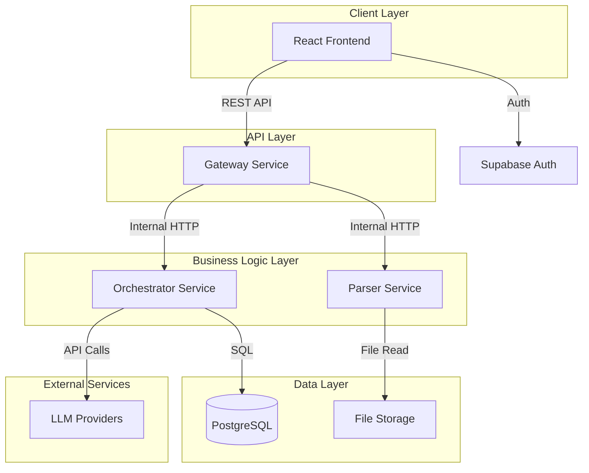
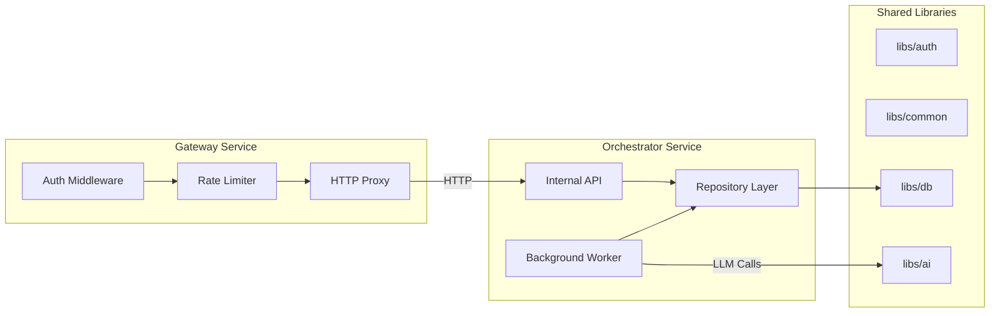
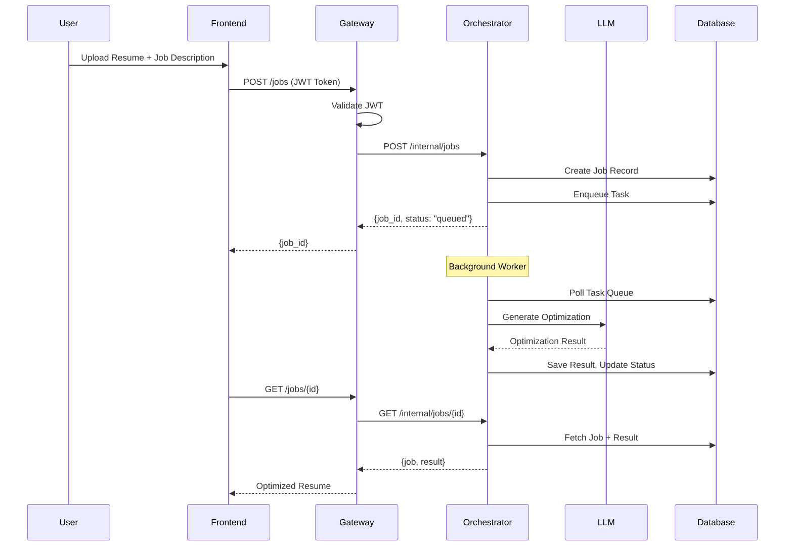
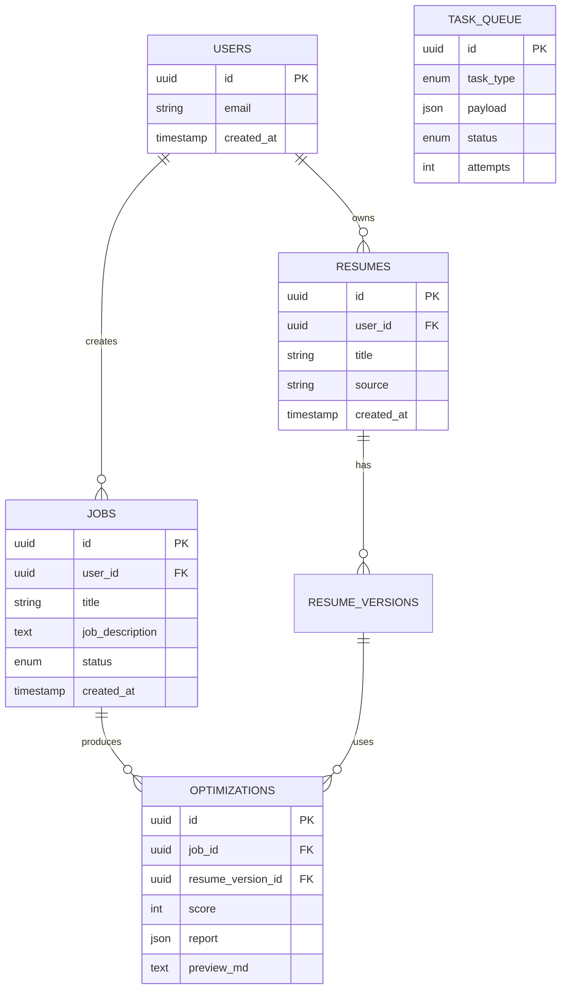

# SmartResume Match: System Methodology

## 1. System Architecture Overview

### 1.1 High-Level Block Diagram



### 1.2 Detailed Service Architecture



---

## 2. Technology Stack

| Layer                | Technology                   | Purpose                                         |
| -------------------- | ---------------------------- | ----------------------------------------------- |
| **Frontend**         | React 19 + TypeScript        | Single Page Application                         |
| **Build Tool**       | Vite                         | Fast development server & bundler               |
| **Styling**          | CSS/TailwindCSS              | UI styling                                      |
| **Auth**             | Supabase Auth                | User authentication & JWT tokens                |
| **API Gateway**      | FastAPI (Python)             | Request routing, auth validation, rate limiting |
| **Orchestrator**     | FastAPI + AsyncIO            | Business logic, task processing                 |
| **Parser**           | FastAPI                      | PDF/Document parsing                            |
| **Database**         | PostgreSQL (via Supabase)    | Persistent data storage                         |
| **ORM**              | SQLAlchemy 2.0 (Async)       | Database abstraction                            |
| **LLM Providers**    | OpenAI GPT-4 / Google Gemini | AI-powered resume optimization                  |
| **Containerization** | Docker + Docker Compose      | Service isolation & deployment                  |

---

## 3. Development Methodology

### 3.1 Microservices Architecture Pattern

The system follows a **strict microservices architecture** with clear boundaries:

1. **Gateway Service** (Stateless)

   - Handles user authentication
   - Routes requests to downstream services
   - No direct database access

2. **Orchestrator Service** (Stateful)

   - Owns the database schema
   - Processes business logic
   - Runs background workers for AI tasks

3. **Parser Service** (Stateless)
   - Handles document parsing
   - No persistent state

### 3.2 Shared Library Pattern

Common code is organized into granular libraries:

```
libs/
├── auth/        # JWT verification, user context
├── common/      # Config, logging, error handling
├── db/          # SQLAlchemy models, repository pattern
└── ai/          # LLM provider abstraction
```

### 3.3 Request Flow



---

## 4. Tools & Resources

### 4.1 Development Tools

| Tool              | Purpose                 |
| ----------------- | ----------------------- |
| VS Code           | Primary IDE             |
| Git               | Version control         |
| Docker Desktop    | Local container runtime |
| Postman/Insomnia  | API testing             |
| pgAdmin/TablePlus | Database management     |

### 4.2 Python Libraries

| Library             | Version | Purpose           |
| ------------------- | ------- | ----------------- |
| FastAPI             | 0.100+  | Web framework     |
| Uvicorn             | 0.20+   | ASGI server       |
| SQLAlchemy          | 2.0+    | Async ORM         |
| Pydantic            | 2.0+    | Data validation   |
| httpx               | 0.25+   | Async HTTP client |
| openai              | 1.0+    | OpenAI API client |
| google-generativeai | 0.3+    | Gemini API client |

### 4.3 Frontend Libraries

| Library               | Purpose         |
| --------------------- | --------------- |
| React 19              | UI framework    |
| TypeScript            | Type safety     |
| @supabase/supabase-js | Auth & realtime |
| react-router          | Client routing  |

---

## 5. Brief Summary: What Will Be Done

### Phase 1: Foundation (Completed)

- [x] Project structure setup (Monorepo)
- [x] Shared library scaffolding
- [x] LLM abstraction layer (OpenAI + Gemini)
- [x] Database models (SQLAlchemy)
- [x] Authentication middleware

### Phase 2: Core Services (In Progress)

- [x] Gateway Service (HTTP Proxy)
- [x] Orchestrator Service (API + Worker)
- [ ] Parser Service (PDF extraction)
- [ ] End-to-end testing

### Phase 3: Frontend Integration (Planned)

- [ ] Connect frontend to Gateway API
- [ ] Job status polling/websockets
- [ ] Result display & download

### Phase 4: Deployment (Planned)

- [ ] Docker Compose production config
- [ ] Cloud deployment (Railway/Render)
- [ ] Environment variable management

---

## 6. Database Schema (ERD)



---

_Document generated for SmartResume Match school project methodology section._
